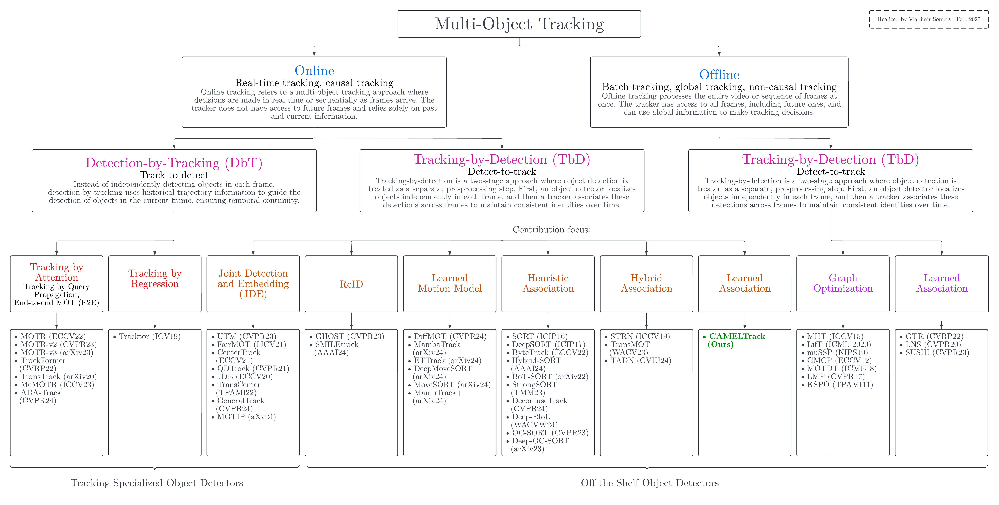

# Multi-Object Tracking Taxonomy  

This repository contains a taxonomy of Multi-Object Tracking (MOT) methods, designed to provide an overview of recent MOT literature. The taxonomy was created as part of my thesis work and emphasizes our contribution, **[CAMELTrack](https://github.com/TrackingLaboratory/CAMELTrack)**.  

The diagram was made using Lucidchart and is available in both JPEG and PDF formats:  

## Diagram Preview  

  

A higher-resolution version is also available for download:  
[Download the PDF](mot_taxonomy_vladimir_somers.pdf)  

## Contributions  

Contributions from the community are welcome! Feel free to submit suggestions to help improve this taxonomy. Creating this taxonomy was not an easy task—it is highly opinionated, and many methods are likely missing or could fit into multiple categories. Additionally, alternative categorizations could have been created, so any feedback or additions are greatly appreciated.
